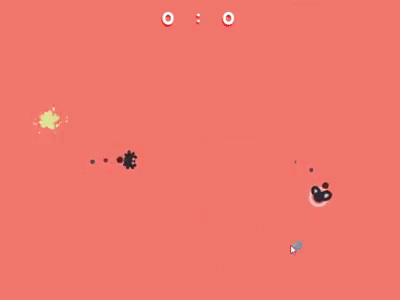

<p align="center"></p>

## Build

1. Build from GDevelop to `bin/web` folder.
2. Run export script and the result `bin/web.zip` will be produced.

```bash
yarn export
```

---

_Prototype only. There are \*bugs\* inside._
